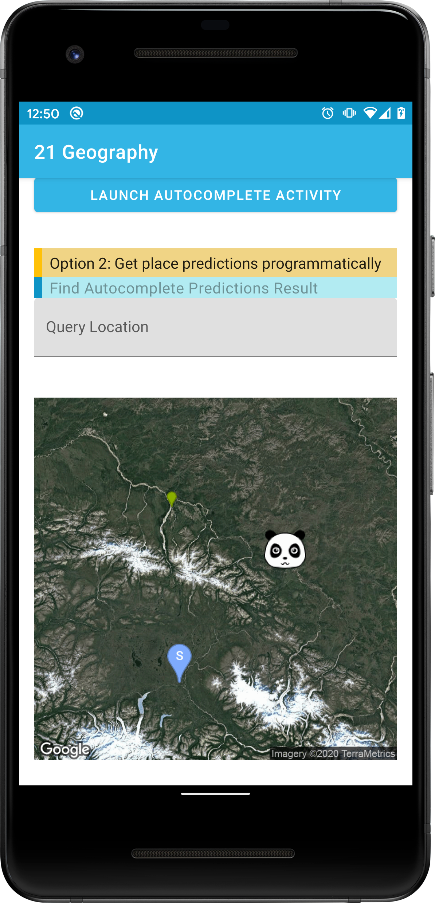

[](https://jitpack.io/#li2/android-place)


#  Geography Library - Android

A library to wrap Google Place Autocomplete SDK,  also get last known location in Rx  to break with the OnActivityResult and callback implementation.

Usage sample: [MainFragment](https://github.com/li2/android-place/blob/master/app/src/main/java/me/li2/android/placesample/MainFragment.kt)

## Usage -  Google Place Autocomplete

Two options to search place by Google Place SDK:

- Option 1: Launch built-in autocomplete activity
- Option 2: Get place predictions programmatically

Further reading [https://medium.com/@li2/android-practice-google-place-autocomplete-search-in-rx-79686271d840](https://medium.com/@li2/android-practice-google-place-autocomplete-search-in-rx-79686271d840)


```kotlin
val placeAutoComplete = PlaceAutoComplete(context, context.getString(R.string.google_api_key))

placeAutoComplete.launchPlaceAutocompleteActivity(activity)
        .subscribeBy(onSuccess = { place: Place ->
        }, onError = {
        })

placeAutoComplete.getPlacePredictions(query)
        .observeOn(AndroidSchedulers.mainThread())
        .subscribeOn(Schedulers.io())
        .subscribeBy(onNext = { predictions: List<AutocompletePrediction> ->
        }, onError = {
        })  
```

## Usage - Geocoder address components

```kotlin
fun getAddressComponents(context: Context, lat: Double, lng: Double): AddressComponents?
fun getAddressComponents(context: Context, addressName: String): AddressComponents?
```


## Usage - Last Known Location

- Rx way to request location permission and service,
- Rx way to get last known location,
- Extension functions to open system location settings and App settings page.

```kotlin
activity?.ifLocationAllowed(onError = {
    toast(it.message.toString())
}, onResult = { result: RequestLocationResult ->
    when (result) {
        RequestLocationResult.ALLOWED -> {
            // location permission granted and service is on,
            // it's good time to get last know location
            requestLastKnownLocation()
        }
        RequestLocationResult.PERMISSION_DENIED -> {
            toast("permission denied")
        }
        RequestLocationResult.PERMISSION_DENIED_NOT_ASK_AGAIN -> {
            // location permission denied, go to App settings
            activity?.openAppSettings(context.packageName)
        }
        RequestLocationResult.SERVICE_OFF -> {
            // location service is turned off, go to system settings
            activity?.openSystemLocationSetting { isServiceOn -> }
        }
    }
})

private fun requestLastLocation() {
    LastKnownLocationUtils.requestLastKnownLocation(context)
        .subscribeBy(onNext = { location ->
            GeocoderUtils.getAddressComponents(context, location.latitude, location.longitude)
        }, onError = { exception ->
        })
}
```

## Usage - Map

```kotlin
val marker1 = MarkerInfo("blue", listOf("62.107733,-145.5419"), 'S')
val marker2 = MarkerInfo("yellow", listOf("Tok, AK"), 'C', icon = "https://raw.githubusercontent.com/li2/android-geography/master/panda.png")
val marker3 = MarkerInfo("green", listOf("Delta Junction, AK"), size = MarkerInfo.MarkerSize.TINY)
generateMapStaticImageUrl(
    apiKey = apiKey,
    central = "63.259591,-144.667969",
    mapType = MapType.SATELLITE,
    markers = listOf(marker1, marker2, marker3),
    size = "400x400",
    zoomLevel = 6)
```



## Download

```gradle
implementation 'com.github.li2.android-geography:location:latest_version'
implementation 'com.github.li2.android-geography:maps:latest_version'
implementation 'com.github.li2.android-geography:place:latest_version'
```


## License

```
    Copyright (C) 2020 Weiyi Li

    Licensed under the Apache License, Version 2.0 (the "License");
    you may not use this file except in compliance with the License.
    You may obtain a copy of the License at

       http://www.apache.org/licenses/LICENSE-2.0

    Unless required by applicable law or agreed to in writing, software
    distributed under the License is distributed on an "AS IS" BASIS,
    WITHOUT WARRANTIES OR CONDITIONS OF ANY KIND, either express or implied.
    See the License for the specific language governing permissions and
    limitations under the License.
```